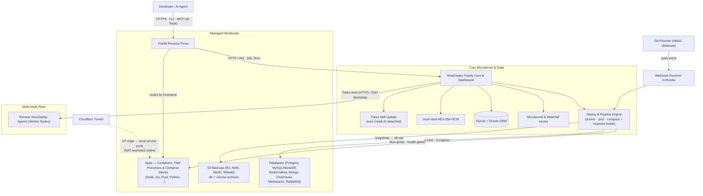

<div align="center">

# 🚀 NineDeploy

**Self-hosted Deployment Platform & PaaS.**  
Deploy apps from Git or container registries with zero downtime, automatic rollback, durable worker recovery, managed databases, encrypted backups, Traefik ingress, one-click panel self-updates, and an AI-native 35-tool MCP server.

[](https://opensource.org/licenses/MIT)
[](https://nodejs.org)
[](./CHANGELOG.md)
[](https://www.typescriptlang.org)
[](https://docker.com)
[](https://github.com/NineDeploy/NineDeploy)
[](https://github.com/NineDeploy/NineDeploy/actions/workflows/ci.yml)

[Website](https://ninedeploy.com) • [Documentation](./docs/QUICKSTART.md) • [1-Click Templates](https://ninedeploy.com/templates) • [Changelog](https://ninedeploy.com/changelog)

</div>

---

## ⚡ Quick Start

### 1-Line Production Install (Bare-Metal Linux — Recommended)

```bash
curl -fsSL https://raw.githubusercontent.com/NineDeploy/NineDeploy/main/install.sh | bash
```

> NineDeploy runs as a hardened `systemd` service (`NoNewPrivileges`, `ProtectSystem=full`, `Restart=always`) with automated database snapshots and direct Docker/PM2 management.

### Or Run with Docker

Add `--docker` to the installer one-liner above for a fully managed container
install — no host Node.js, no systemd; the installer follows an existing
install on re-runs, so upgrades are the same command:

```bash
curl -fsSL https://raw.githubusercontent.com/NineDeploy/NineDeploy/main/install.sh | bash -s -- --docker
```

Or bring your own compose (required secret + docker GID, restart policy,
health-gated readiness — see `docker-compose.prod.yml`):

```bash
echo "NINEDEPLOY_JWT_SECRET=$(openssl rand -hex 32)" >> .env
echo "DOCKER_GID=$(getent group docker | cut -d: -f3)" >> .env
docker compose -f docker-compose.prod.yml up -d
```

Or run the image directly:

```bash
docker run -d --name ninedeploy \
  -v /var/run/docker.sock:/var/run/docker.sock \
  --group-add $(getent group docker | cut -d: -f3) \
  -v ninedeploy-data:/data \
  -p 3000:3000 \
  -e NINEDEPLOY_JWT_SECRET=$(openssl rand -hex 32) \
  ghcr.io/ninedeploy/ninedeploy:latest
```

---

## 📐 System Architecture



---

## 📚 Modular Documentation Hub

For in-depth guides, operational workflows, and configuration references:

| Guide | Description |
| :--- | :--- |
| 🚀 [**Quickstart & Upgrading**](./docs/QUICKSTART.md) | Installation options, in-place upgrades, systemd unit configuration, and environment setup. |
| 🔐 [**Private Repository Guide**](./docs/PRIVATE_REPO_GUIDE.md) | End-to-end playbook for deploying a private GitHub/GitLab repo: GitHub PAT, server-generated SSH deploy keys, encrypted source credentials, build-pack selection, auto-deploy webhooks. |
| 📄 [**`.ninedeploy` Manifest**](./docs/NINEDEPLOY_MANIFEST.md) | The repo-side manifest: runtime and build sections, routes, alerts, database binding, volume backup policy, and the `manifest init/validate/show` CLI. |
| 🔄 [**Deployments & Pipelines**](./docs/DEPLOYMENTS.md) | Blue-green zero-downtime releases, cancellation, watch paths, and ephemeral PR preview environments. |
| 🏢 [**Workspaces & RBAC**](./docs/WORKSPACES_RBAC.md) | Multi-tenant workspace scoping, team member invitations, and role-based permissions matrix. |
| 🔒 [**Security & Single Sign-On**](./docs/SECURITY_SSO.md) | Dual-vault AES-256-GCM encryption, OIDC SSO (Google, GitHub, Okta), Passkeys (WebAuthn), and TOTP 2FA. |
| 🗄️ [**Databases & S3 Backups**](./docs/DATABASES_BACKUPS.md) | 1-click managed databases, auto-injected connection strings, streaming AES-256-GCM encryption, offsite S3 destinations, and tar-slip safe restore. |
| 🌐 [**Traefik Ingress & Tunnels**](./docs/TRAEFIK_INGRESS.md) | Dynamic routing, Let's Encrypt automated SSL (HTTP-01 & DNS-01), middlewares, and Cloudflare Tunnels. |
| 🔌 [**Plugins & Microkernel**](./docs/PLUGINS_MICROKERNEL.md) | Microkernel lifecycle hooks (`deploy.before`, `deploy.after`), dynamic menus, and driver registries. |
| 🤖 [**AI MCP, CLI & SDK**](./docs/AI_MCP_CLI.md) | 35 Model Context Protocol tools for AI assistants (Cursor, Claude, Antigravity), CLI reference, and TypeScript SDK. |
| 🩺 [**Troubleshooting & Ops**](./docs/TROUBLESHOOTING.md) | Diagnostic workflows, socket permission fixes, database locking resolution, and healthcheck tuning. |
| 🏗️ [**Architecture Deep Dive**](./ARCHITECTURE.md) | Complete internal design specification, Drizzle schema models, and data directory layouts. |

---

## 🌟 Key Features

- 🚀 **Zero-Downtime Blue-Green Deploys**: Deploy without dropping connections. Health-gated traffic switchover ensures instant rollback if a new build fails, and past deploys settle into an honest `superseded` history instead of staying "Running" forever.
- 🧑‍🔧 **One-Click Panel Self-Update**: A dashboard banner offers the new release and runs this install's own `install.sh --version <tag>` detached from systemd, snapshotting data first and restarting the panel onto the pinned version — progress survives the restart it performs.
- 🏢 **Workspaces & Multi-Tenancy**: Organize projects, servers, databases, and teams across isolated workspaces with 4-tier RBAC.
- 🔑 **Enterprise SSO & Passkeys**: Authenticate via OpenID Connect (Google, GitHub, Keycloak, Okta), biometric Passkeys (WebAuthn), or TOTP 2FA.
- 🗄️ **1-Click Databases & Encrypted S3 Backups**: Instant Postgres (with `pgvector`), MySQL, Redis, MongoDB, ClickHouse, and RabbitMQ with streaming AES-256-GCM snapshots and automated offsite sync to Cloudflare R2 / AWS S3.
- 🏷️ **Projects, Workspaces & Labels**: Tag a service into as many projects, workspaces and labels as it belongs to, then filter the whole panel by all three at once — AND across the groups, OR inside one.
- 💾 **Volume Attachments & Backups**: Mount any number of managed Docker volumes into a service at explicit paths, then snapshot, restore or download each one — snapshots carry operator labels for the backups page, retention pruning and off-site copies are built in.
- ⏰ **Scheduled Jobs & Cron Presets**: Attach 5-field cron jobs to any service with preset-driven editors, human-readable schedule descriptions and per-job run history.
- 📄 **`.ninedeploy` Manifest**: Keep runtime, build, routes, alerts and backup policy next to the code. `ninedeploy manifest validate` schema-checks it and blocks credential-shaped values before they reach git history.
- ♻️ **Durable Deployment Recovery**: Worker-owned Hub provisioning survives browser disconnects and server restarts, then idempotently resumes template databases, attachments, environment reconciliation, and application deployment.
- 🤖 **Native AI Superpowers**: Built-in 35-tool Model Context Protocol (MCP) server enables AI coding agents (Claude, Cursor, Antigravity, Cline) to query logs, trigger builds, and manage resources, with an optional fail-closed read-only mode.
- 🌐 **Automated Ingress & Tunnels**: Built-in Traefik with automated wildcard Let's Encrypt certificates and zero-configuration Cloudflare Tunnels for NAT-restricted nodes.
- 💯 **Enforced Coverage Gates**: 4,592 Vitest specs run in CI. `db`, `schemas`, `sdk`, `mcp`, `plugin-sdk` and the CLI hold a strict 100% gate; the web dashboard enforces a 99% floor and the server 95%, so a regression fails the build rather than sliding through.

---

## 💻 Interactive CLI (`ninedeploy`)

```bash
# Install CLI globally
npm install -g ninedeploy

# 1-Click setup & auto-start local Docker server
ninedeploy init

# Check health & diagnostics
ninedeploy doctor

# Manage infrastructure & services
ninedeploy services list
ninedeploy services create
ninedeploy services deploy <service-id>
ninedeploy system dashboard

# Deploy a private repository
ninedeploy sources create
ninedeploy webhooks create <service-id>

# Manage the repo-side .ninedeploy manifest
ninedeploy manifest init
ninedeploy manifest validate
```

---

## 🤖 AI Assistant Integration (MCP)

Add NineDeploy to your Claude Desktop or Cursor configuration:

```json
{
  "mcpServers": {
    "ninedeploy": {
      "command": "npx",
      "args": ["-y", "@ninedeploy/mcp"],
      "env": {
        "NINEDEPLOY_URL": "https://your-ninedeploy-instance.com",
        "NINEDEPLOY_TOKEN": "nd_tok_xxxxxxxxxxxx",
        "NINEDEPLOY_MCP_READONLY": "1"
      }
    }
  }
}
```

---

## 🛠️ Monorepo Structure

```
NineDeploy/
├── apps/
│   ├── server/       # Fastify core, deploy engine, microkernel & SQLite store
│   ├── web/          # React 19 SPA dashboard (served directly by the API)
│   └── cli/          # Interactive terminal CLI (ninedeploy)
├── packages/
│   ├── db/           # Drizzle ORM schemas and migrations
│   ├── schemas/      # Shared Zod validation schemas
│   ├── sdk/          # Typed TypeScript API client
│   ├── mcp/          # Model Context Protocol server (35 tools for AI)
│   └── plugin-sdk/   # Microkernel plugin interfaces and driver registries
├── website/          # Landing page, interactive docs, and template hub
└── docs/             # Modular architectural and operational guides
```

---

## 📄 License

NineDeploy is open-source software licensed under the [MIT License](./LICENSE).
